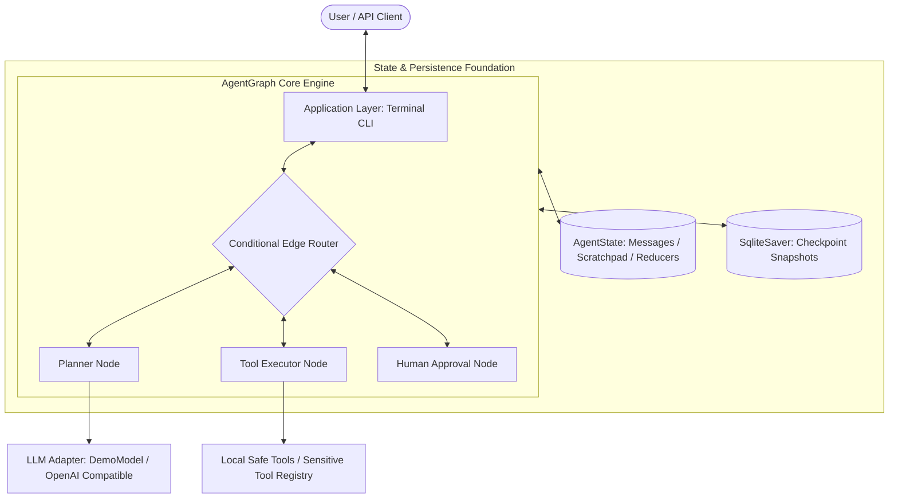
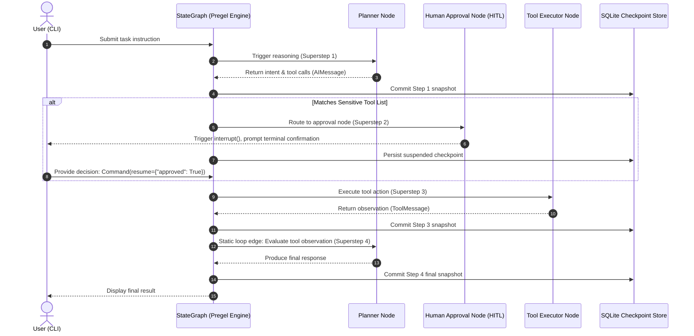

# AgentGraph

> **A Declarative Graph Orchestrator for Autonomous Agents, evolved from Imperative Runtime Loops.**  
> *Built on LangGraph Pregel Superstep Engine, State Reducers, and Immutable Checkpointing.*

[](https://www.python.org/downloads/)
[](https://github.com/langchain-ai/langgraph)
[](https://github.com/astral-sh/uv)
[](https://github.com/astral-sh/ruff)
[](tests/)

[ 简体中文 ](README.md) | [ English ](README.en.md)

---

## 1. Overview

### What is AgentGraph?
**AgentGraph** is a lightweight, production-grade autonomous agent graph orchestration reference implementation and runtime system. Evolved from an early in-house imperative runtime loop (`while not finished:`), the system undergoes a complete architectural paradigm shift to **Pregel superstep scheduling**, **declarative state reducers**, and **immutable spatiotemporal checkpointing** powered by LangGraph.

### Why does it exist?
Traditional autonomous agents typically rely on an imperative loop to drive agent reasoning and action. In production environments, this imperative design faces several fundamental architectural bottlenecks:
1. **Spaghetti Control Flow**: Branching, dynamic retries, error fallbacks, and multi-turn loops rapidly devolve into deeply nested, fragile `if-else` blocks.
2. **Shared Mutable State**: In-place mutation of shared context dictionaries leads to race conditions and dirty writes during asynchronous or parallel execution.
3. **Blocking Human-in-the-Loop (HITL)**: Synchronous `input()` or thread-blocking polling monopolizes compute resources; server restarts or container migrations drop pending human approval requests permanently.
4. **Absence of Spatiotemporal Snapshots**: Flat chat histories preserve only conversational text, losing step-by-step intermediate variables, reasoning thoughts, and time-travel debugging capabilities.

AgentGraph resolves these challenges by adhering to a strict design philosophy: **State-centricity, Atomic Pure Nodes, Decoupled Topology, and Stateless Suspension**.

---

## 2. Implemented Features

> **Note**: In strict accordance with engineering discipline, only fully implemented and test-verified capabilities (56 unit and integration tests passing) are listed below. For upcoming features, see [Roadmap](#10-roadmap).

- **Declarative StateGraph Orchestration**: Strongly typed state schemas based on `TypedDict` and functional reducers (`add_messages`, `append_reducer`, `merge_dict_reducer`) that guarantee atomic incremental delta merging.
- **Pure-Function Stateless Nodes**: Planner node (`planner`), tool execution node (`tool_executor`), and human approval node (`human_approval`) wrapped in `with_error_boundary` exception barriers.
- **Adaptive ReAct Closed-Loop Routing**: Declarative conditional edges supporting dynamic tool-call loops, direct answers, and recursion limit fuses to prevent infinite loops.
- **Stateless Human-in-the-Loop (HITL)**: Leverages native LangGraph 0.2 `interrupt()` to suspend execution upon encountering sensitive tools (e.g., file deletion, shell execution). The execution context is frozen to SQLite, and can be resumed or rejected via external `Command(resume=...)` without holding open threads.
- **SQLite Checkpoint & Time Travel**: Automatic state persistence at each superstep boundary, providing tenant session isolation via `thread_id` and parallel branch forking from historical checkpoints.
- **Production Terminal CLI**:
  - `jarvis chat`: Interactive multi-turn REPL with streaming-like Rich status cards.
  - `jarvis run`: Single-task execution with `--quiet` mode and `--yes` non-interactive auto-approval.
  - `jarvis sessions`: Inspect historical checkpoint snapshots stored in SQLite.
- **Dual-Model LLM Adapter**:
  - **Zero-Key Offline Demo Model**: Built-in deterministic `DemoModel` for instant evaluation of ReAct reasoning, tool calls, and HITL approval without network access or API keys.
  - **Universal OpenAI-Compatible Client**: Asynchronous `httpx`-based client compatible with DeepSeek, OpenAI, Ollama, and vLLM.

---

## 3. Architecture

AgentGraph enforces a layered, decoupled architecture with strict responsibility boundaries:



### End-to-End Execution Sequence



---

## 4. Core Concepts

| Concept | Definition & Responsibility in AgentGraph |
| :--- | :--- |
| **AgentState** | The Single Source of Truth for the entire graph. Strongly typed, serving as the sole communication medium between nodes. |
| **Reducer** | Functional merger for state fields (e.g., `add_messages` for idempotent message upsert/deletion, `append_reducer` for cumulative thoughts). |
| **Node** | Pure callable calculation unit. Accepts an immutable state snapshot and yields a partial delta dictionary (`dict[str, Any]`), with no side effects. |
| **Edge / Router** | Static edges dictate deterministic transitions; conditional edges inspect state dynamically to determine next destinations. |
| **Interrupt** | Stateless execution suspension. On sensitive operations, the graph commits state to disk and yields control, awakened via `Command`. |
| **Checkpoint** | Superstep-level system snapshot. Stored in SQLite as a DAG version tree, enabling session isolation and time-travel debugging. |

---

## 5. Project Structure

```text
AgentGraph/
├── cli/                 # Application layer (Typer REPL session, task runner, and Rich UI)
├── graph/               # Graph topology layer (StateGraph builders, edges, router, ReAct and HITL graphs)
├── nodes/               # Pure calculation nodes (Planner, Tool Executor, Human Approval)
├── state/               # State model & reducers (AgentState schema, append_reducer, merge_dict)
├── tools/               # Tool execution layer (Builtin tools and sensitive tool registry)
├── checkpoints/         # Persistence layer (SQLite/Memory saver factory and CheckpointManager)
├── docs/                # Comprehensive documentation hub (Architecture, Design, Dev, ADR, Roadmap)
├── scripts/             # Infrastructure and quality gate scripts (check.py)
├── tests/               # Test suite with 56 unit and integration tests (100% passing)
└── pyproject.toml       # Build configuration, dependency specs, and toolchain rules
```

---

## 6. Getting Started

### 6.1 Prerequisites
- **Python**: `>= 3.12` (Tested on Python 3.12 and Python 3.14)
- **Package Manager**: [uv](https://github.com/astral-sh/uv) (Recommended for deterministic, fast environments)

### 6.2 Installation
```bash
# Clone the repository
git clone https://github.com/PublicYang/AgentGraph.git
cd AgentGraph

# Sync dependencies using uv
uv sync
```

### 6.3 30-Second Quick Start (Zero-Key Offline Demo Mode)

Explore full autonomous agent capabilities without requiring external network connectivity or API keys:

```bash
# 1. Start interactive multi-turn REPL chat
uv run jarvis chat --demo

# 2. Run single task: mathematical tool calculation
uv run jarvis run "Please calculate 25 * 40 + 150" --demo

# 3. Test Human-in-the-Loop (HITL) sensitive action interception
uv run jarvis run "Delete app.log" --demo

# 4. View historical session snapshots saved in SQLite
uv run jarvis sessions
```

> **Note**: The CLI binary entrypoint registered in `pyproject.toml` is `jarvis`. You may also run commands directly via `python -m cli.app <command>`.

### 6.4 Connecting Real LLM Endpoints

AgentGraph supports any provider compatible with the OpenAI API format (OpenAI, DeepSeek, Ollama, etc.):

```bash
# Configure environment variables
export OPENAI_API_KEY="YOUR_API_KEY"
export OPENAI_BASE_URL="https://api.deepseek.com/v1"
export OPENAI_MODEL_NAME="deepseek-chat"

# Launch session connected to real model
uv run jarvis chat
```

### 6.5 Running Test Suite
```bash
uv run pytest
```
*All 56 unit and integration test cases pass in under two seconds.*

---

## 7. Configuration

| Environment Variable | Default Value | Description |
| :--- | :--- | :--- |
| `OPENAI_API_KEY` | None | API authentication key for remote LLM providers (not required in `--demo` mode). |
| `OPENAI_BASE_URL` | `https://api.openai.com/v1` | Base URL for OpenAI-compatible endpoints (e.g., DeepSeek, or local Ollama `http://localhost:11434/v1`). |
| `OPENAI_MODEL_NAME` | `gpt-4o` | Target model identifier (e.g., `deepseek-chat`, `gpt-4o`, `qwen2.5:7b`). |

Checkpoints are persisted by default to `.jarvis_checkpoints.db` in the working directory (configurable via the `--db` option).

---

## 8. Development & Quality Gates

AgentGraph enforces strict code quality and pre-merge validation gates:

```bash
# Run one-click comprehensive quality gate (Lint + Format + Mypy + Pytest)
uv run python scripts/check.py

# Run individual quality checks
uv run ruff check .          # Lint check
uv run ruff format --check . # Code formatting check
uv run mypy .                # Strict type checking
uv run pytest -v             # Full unit and integration tests
```

---

## 9. Documentation

Detailed architectural and design references are organized in the [`docs/`](docs/) directory:

```text
docs/
├── architecture/                     # Architecture & Engine Mechanics
│   ├── system-architecture.md        # Layered architecture, superstep lifecycle, and execution sequences
│   └── graph-migration.md            # 10 core paradigm shifts from Runtime Loop to Graph Orchestration
├── design/                           # Subsystem Designs
│   ├── state-design.md               # AgentState schema, reducers, and concurrency conflict resolution
│   ├── hitl-and-interrupt.md         # Stateless HITL, interrupt() mechanics, and Command resume protocol
│   └── checkpoint-and-timetravel.md  # SQLite checkpointer, session isolation, and time-travel forking
├── development/                      # Developer Guides
│   ├── engineering-guide.md          # Technology selection rationale, standards, and quality gates
│   └── cli-reference.md              # CLI reference manual (chat, run, sessions, version)
├── adr/                              # Architecture Decision Records
│   ├── README.md                     # ADR index and authoring guidelines
│   ├── ADR-001-why-langgraph.md      # ADR-001: Why LangGraph was chosen
│   ├── ADR-002-stategraph-first.md   # ADR-002: Why start from low-level StateGraph primitives
│   └── ADR-003-loop-to-graph.md      # ADR-003: Why evolve Runtime Loop into Graph Orchestration
└── roadmap/                          # Engineering Roadmap
    └── roadmap.md                    # 10-phase roadmap details (Completed & Planned)
```

---

## 10. Roadmap

The engineering roadmap is partitioned into four major versions across ten progressive phases:

### Completed
- [x] **Phase 0: Design Gate**: Architecture blueprints, paradigm migration mapping, state schema specs, and ADRs.
- [x] **Phase 1: Project Skeleton**: Modern Python project layout, package boundaries, and modular isolation.
- [x] **Phase 2: Dev Infrastructure**: uv, Ruff, Mypy, Pytest foundation, and automated quality gate scripts.
- [x] **Phase 3: StateGraph**: Core `StateGraph` instantiation, TypedDict schemas, and reducer mechanisms.
- [x] **Phase 4: Nodes**: Pure functional node factories (`planner`, `tool_executor`) and error boundary isolation.
- [x] **Phase 5: Edges**: Static edge connections, `START`/`END` special nodes, and Mermaid diagram export.
- [x] **Phase 6: Conditional Routing**: Dynamic conditional edges, ReAct feedback loops, and recursion limit fuses.
- [x] **Phase 7: Interrupt & Resume**: Native stateless interrupt suspensions, external command resume, and HITL approvals.
- [x] **Phase 8: Checkpoint**: SQLite persistence, multi-tenant session isolation, and time-travel state recovery.
- [x] **Application Layer: CLI**: Interactive REPL multi-turn chat, task runner, and zero-key offline demo model.

### Planned (Detailed Designs Completed)
- [ ] **Phase 9: Subgraph**: Hierarchical multi-agent orchestration (Supervisor / Researcher / Coder) with isolated state scopes.
- [ ] **Phase 10: Parallel Branch**: Fan-out dispatch, Fan-in aggregation nodes, and deterministic parallel reducer merging.
- [ ] **MCP Client**: Standardized Model Context Protocol (MCP) tool integration.
- [ ] **Web API Service**: FastAPI-based asynchronous streaming event gateway.
