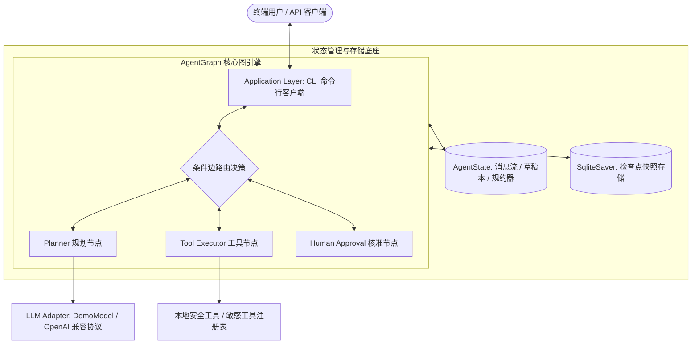
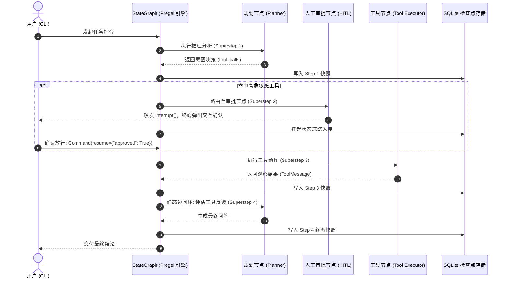

# AgentGraph

> **基于 LangGraph 的声明式智能体图编排工程参考与运行时系统**  
> *A Declarative Graph Orchestrator for Autonomous Agents, evolved from Imperative Runtime Loops.*

[](https://www.python.org/downloads/)
[](https://github.com/langchain-ai/langgraph)
[](https://github.com/astral-sh/uv)
[](https://github.com/astral-sh/ruff)
[](tests/)

[ 简体中文 ](README.md) | [ English ](README.en.md)

---

## 1. Overview (项目概览)

### What is AgentGraph?
**AgentGraph** 是一个轻量级、工程级可靠的自主智能体（Autonomous Agent）图编排参考实现与运行时系统。项目从自研第一代命令式循环运行时（Imperative Runtime Loop）脱胎演化而来，基于 LangGraph 底层的 **Pregel 超步调度（Superstep Engine）**、**声明式状态规约（State Reducers）** 与 **不可变快照持久化** 进行了彻底的图化范式重构。

### Why does it exist?
传统自主智能体通常使用命令式的 `while not finished:` 循环驱动。当面对复杂的真实场景时，命令式架构暴露出以下难以克服的瓶颈：
1. **控制流面条化**: 分支跳转、回退、动态重试混杂在嵌套 `if-else` 中，代码迅速腐化。
2. **状态共享与竞态**: 全局可变上下文在多模块或并发调用中频繁出现脏写覆盖。
3. **阻塞式人机审批**: 同步 `input()` 阻塞独占计算线程，服务重启或容器漂移导致挂起任务全量丢失。
4. **缺乏时空状态快照**: 无法精确回溯至智能体思考的任意历史微步进行故障排查与分叉推演（Time Travel）。

AgentGraph 通过严格遵循“以状态为核心、节点原子化、连线拓扑化、审批无状态化”的设计哲学，为企业级可靠智能体提供坚实可靠的底层架构底座。

---

## 2. Implemented Features (已实现核心能力)

> 提示：本项目严格遵守工程纪律，以下仅列出当前代码库已完全落地并通过 56 项测试验证的能力。计划中特性请参见 [Roadmap](#10-roadmap)。

- **声明式 StateGraph 拓扑编排**: 基于强类型 `TypedDict` 定义统一状态，使用函数式规约器（`add_messages`、`append_reducer`、`merge_dict_reducer`）保障并发合并的原子性。
- **纯函数无状态计算节点**: 规划器（`planner`）、工具执行器（`tool_executor`）与人机核准节点（`human_approval`）完全无状态化，外置 `with_error_boundary` 异常隔离屏障。
- **ReAct 动态自适应闭环**: 声明式条件路由（Conditional Edge），支持意图决策、工具调用回环推演以及最大递归深度（Recursion Limit）熔断防死循环。
- **无状态人机协同 (Stateless HITL)**: 依赖 LangGraph 原生 `interrupt()` 挂起敏感高危操作（如删除、Shell 指令），进程完全释放并持久化冻结；通过 `Command(resume=...)` 外部指令无损复苏或驳回重规。
- **SQLite 状态检查点与时空快照**: 全系统状态在每个超步（Superstep）自动持久化至 SQLite，天然支持多会话隔离（`thread_id`）与时间旅行（Time Travel）历史追溯。
- **开箱即用终端命令行客户端 (CLI)**:
  - `jarvis chat`: 交互式 REPL 多轮终端对话，自带 Rich 格式化流式卡片。
  - `jarvis run`: 单次指令即时推演，支持 `--quiet` 静默模式与 `--yes` 非交互式自动核准。
  - `jarvis sessions`: 查看保存在 SQLite 中的历史会话快照清单。
- **双模大模型适配**:
  - **离线确定性 Demo 模式**: 内置 `DemoModel`，零 API Key、零外部网络即可完整体验 ReAct 推理、工具调用与 HITL 审批拦截。
  - **通用 OpenAI 兼容协议**: 基于 `httpx` 直连 OpenAI、DeepSeek、Ollama、vLLM 等主流端点。

---

## 3. Architecture (系统架构)

AgentGraph 采用严格的分层解耦架构，从上层终端接口到底层存储具有明确的职责边界：



### 核心流转时序



---

## 4. Core Concepts (核心概念)

| 核心概念 | 定义与在 AgentGraph 中的职责 |
| :--- | :--- |
| **AgentState** | 图的单一可信数据源（Single Source of Truth）。强类型定义，节点间传递数据的唯一介质。 |
| **Reducer** | 状态字段的规约合并函数（如 `add_messages` 增量追加/覆盖更新，`append_reducer` 思考草稿累加）。 |
| **Node** | 无状态原子计算函数。只接收当前只读状态快照，只返回局部增量字典（Delta），无副作用。 |
| **Edge / Router** | 静态边负责确定性流向；条件边负责读取最新状态动态计算分支目标（工具、人工审批或结束）。 |
| **Interrupt** | 无状态中断挂起。发生敏感操作时图引擎保存快照并退出，由外部注入 `Command` 唤醒。 |
| **Checkpoint** | 超步全态快照。在 SQLite 中保存状态版本树，支持多会话隔离与时间旅行（Time Travel）。 |

---

## 5. Project Structure (关键目录结构)

```text
AgentGraph/
├── cli/                 # 终端应用程序层 (Typer 驱动的 REPL 会话、执行器与 Rich UI)
├── graph/               # 声明式图拓扑层 (StateGraph 构建器、静态边、条件路由、ReAct 与 HITL 图)
├── nodes/               # 原子计算节点层 (Planner 节点、Tool 节点、Human Approval 审批节点)
├── state/               # 状态模型与规约层 (AgentState 契约、append_reducer、merge_dict)
├── tools/               # 工具执行层 (基础工具实现与敏感工具注册清单)
├── checkpoints/         # 持久化存储层 (SQLite / 内存检查点适配工厂与 CheckpointManager)
├── docs/                # 标准化技术文档库 (架构、设计、开发规范、ADR、演进路线)
├── scripts/             # 工程基础设施与自动化质量门禁 (check.py)
├── tests/               # 完备的单元测试与集成测试套件 (56 项全覆盖测试)
└── pyproject.toml       # 项目构建、依赖规范与工具链配置
```

---

## 6. Getting Started (快速开始)

### 6.1 环境要求
- **Python**: `>= 3.12` (已通过 Python 3.12 与 Python 3.14 环境验证)
- **包管理工具**: 推荐使用 [uv](https://github.com/astral-sh/uv)（极速且确定性）

### 6.2 安装与同步依赖
```bash
# 克隆仓库
git clone https://github.com/PublicYang/AgentGraph.git
cd AgentGraph

# 使用 uv 一键安装依赖并生成虚拟环境
uv sync
```

### 6.3 30 秒快速体验 (零 Key 离线演示模式)

无需配置任何 API Key 或外部网络，直接启动交互式体验：

```bash
# 1. 启动交互式终端 REPL 多轮对话
uv run jarvis chat --demo

# 2. 单次指令推演：数学计算工具调用
uv run jarvis run "帮我计算 25 * 40 + 150" --demo

# 3. 体验人机协同 (HITL) 敏感操作审批拦截
uv run jarvis run "帮我删除 app.log" --demo

# 4. 查看持久化在 SQLite 中的历史会话快照
uv run jarvis sessions
```

> **说明**: 项目在 `pyproject.toml` 中注册的脚本入口为 `jarvis`。你也可以通过 `python -m cli.app <command>` 直接运行。

### 6.4 连接真实大语言模型

AgentGraph 原生支持任何兼容 OpenAI 协议的模型提供商（OpenAI、DeepSeek、Ollama 等）：

```bash
# 配置环境变量
export OPENAI_API_KEY="YOUR_API_KEY"
export OPENAI_BASE_URL="https://api.deepseek.com/v1"
export OPENAI_MODEL_NAME="deepseek-chat"

# 启动真实模型会话
uv run jarvis chat
```

### 6.5 运行全量测试
```bash
uv run pytest
```
*当前全量 56 项测试用例应当在毫秒级内全部通过（PASS）。*

---

## 7. Configuration (环境配置说明)

| 环境变量 | 默认值 | 说明 |
| :--- | :--- | :--- |
| `OPENAI_API_KEY` | 无 | 大语言模型访问密钥（接入真实模型时必填，Demo 模式下无需配置）。 |
| `OPENAI_BASE_URL` | `https://api.openai.com/v1` | 模型服务兼容端点（如 DeepSeek、本地 Ollama `http://localhost:11434/v1`）。 |
| `OPENAI_MODEL_NAME` | `gpt-4o` | 模型标识符（如 `deepseek-chat`、`gpt-4o`、`qwen2.5:7b`）。 |

数据库默认持久化在当前工作目录的 `.jarvis_checkpoints.db`（可通过 `--db` 参数自定义路径）。

---

## 8. Development & Quality Gates (工程开发与质量门禁)

本项目严格遵循代码质量门禁纪律，所有功能合并前必须保证门禁全绿：

```bash
# 运行一键全量质量门禁 (Lint + Format + Mypy + Pytest)
uv run python scripts/check.py

# 单独执行各项检查
uv run ruff check .          # 代码 Lint 校验
uv run ruff format --check . # 格式化排版校验
uv run mypy .                # 严格静态类型推导
uv run pytest -v             # 单元与集成测试
```

---

## 9. Documentation (技术文档导航)

完整的设计与架构深度解析已标准化沉淀至 `docs/` 目录：

```text
docs/
├── architecture/                     # 架构体系
│   ├── system-architecture.md        # 分层架构、Pregel 超步调度与生命周期
│   └── graph-migration.md            # 从 Runtime Loop 到图编排的 10 大范式迁移
├── design/                           # 核心组件专项设计
│   ├── state-design.md               # AgentState 规范、规约器与并发写安全
│   ├── hitl-and-interrupt.md         # 无状态人机协同 (HITL) 与 Command 恢复协议
│   └── checkpoint-and-timetravel.md  # SQLite 持久化检查点与时间旅行机制
├── development/                      # 开发者指引
│   ├── engineering-guide.md          # 技术选型论证、开发规范与质量门禁
│   └── cli-reference.md              # 终端 CLI 命令行完整手册
├── adr/                              # 架构决策记录
│   ├── README.md                     # ADR 总览与维护规范
│   ├── ADR-001-why-langgraph.md      # ADR-001: 为什么迁移至 LangGraph
│   ├── ADR-002-stategraph-first.md   # ADR-002: 为什么坚持底层 StateGraph 原语
│   └── ADR-003-loop-to-graph.md      # ADR-003: 为什么 Runtime Loop 演进为 Graph
└── roadmap/                          # 演进路线图
    └── roadmap.md                    # 十阶段演进路线规划与现状
```

---

## 10. Roadmap (演进路线图)

AgentGraph 将智能体系统的图化重构严格划分为四大版本与十个渐进阶段：

### Completed (已完成)
- [x] **Phase 0: Design Gate**: 架构全景设计、概念映射表、状态规约规范与 ADR 架构决策。
- [x] **Phase 1: Project Skeleton**: 现代化工程骨架、包边界与模块依赖隔离。
- [x] **Phase 2: Dev Infrastructure**: uv、Ruff、Mypy、Pytest 测试基建与自动化质量门禁脚本。
- [x] **Phase 3: StateGraph**: 底层 `StateGraph` 原生构建、TypedDict 与 Reducer 规约机制。
- [x] **Phase 4: Nodes**: 无状态纯函数节点设计（Planner、Tool）与异常隔离边界。
- [x] **Phase 5: Edges**: 静态拓扑连接、`START`/`END` 特殊节点与 Mermaid 图静态导出。
- [x] **Phase 6: Conditional Routing**: 动态条件边路由、ReAct 自适应闭环与防死循环保护。
- [x] **Phase 7: Interrupt & Resume**: 原生无状态中断挂起、外部指令唤醒与人机审批（HITL）。
- [x] **Phase 8: Checkpoint**: SQLite 检查点持久化、多会话隔离与时间旅行（Time Travel）快照追溯。
- [x] **Application Layer: CLI**: 完整的交互式终端 REPL 会话、单次任务推演与离线 Demo 规则模型。

### Planned (计划中 - 设计已就绪)
- [ ] **Phase 9: Subgraph**: 分层多智能体（Supervisor / Researcher / Coder）独立子图与黑盒状态隔离。
- [ ] **Phase 10: Parallel Branch**: 扇出（Fan-out）并发分发、扇入（Fan-in）汇聚节点与并发状态安全规约。
- [ ] **MCP Client**: 对接 Model Context Protocol (MCP) 分布式工具集成。
- [ ] **Web API Service**: 基于 FastAPI 的异步流式事件（Streaming）推送接口。
