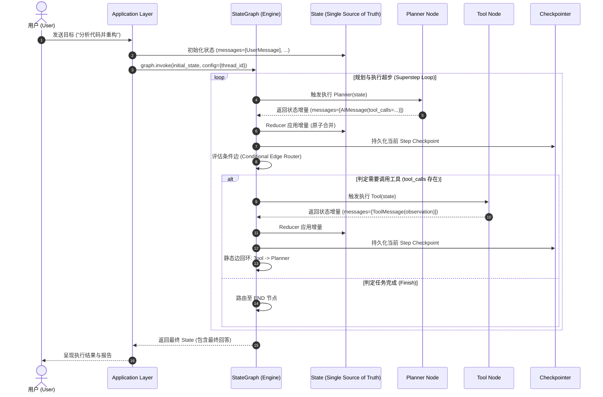
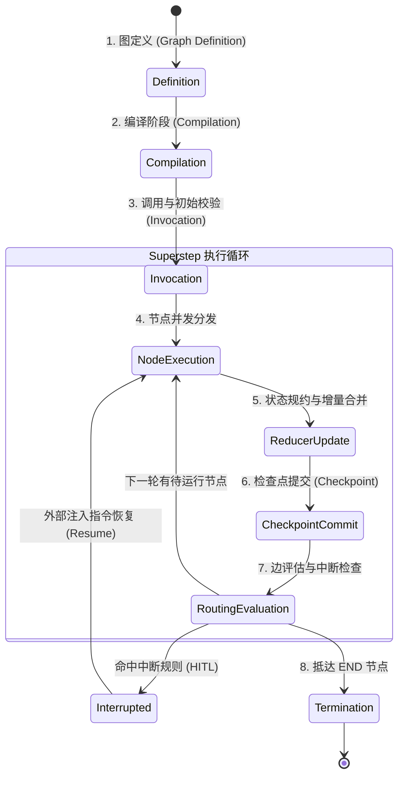

# Jarvis Agent Pro 架构设计 (Architecture)

## 1. 系统架构定位

Jarvis Agent Pro 是将传统的单体命令式智能体运行时（Imperative Agent Runtime Loop）重构为声明式图编排系统（Declarative Graph Orchestrator）的标准工程实践。

系统采用严格的分层解耦架构，从上层应用接口到最底层的存储与网络基础设施，每一层具备清晰的职责边界与契约约束。

---

## 2. 分层架构模型 (Layered Architecture)

```
┌─────────────────────────────────────────────────────────────┐
│                    Application Layer                        │
│   (CLI Entrypoint / Web API / WebSocket / Streaming Client) │
└──────────────────────────────┬──────────────────────────────┘
                               │ Ingest User Input & Config
                               ▼
┌─────────────────────────────────────────────────────────────┐
│                    StateGraph Layer                         │
│  (Graph Topology / Compilation / Edges / Conditional Router)│
└──────────────┬───────────────────────────────┬──────────────┘
               │ Invokes Nodes                 │ Reads / Writes
               ▼                               ▼
┌──────────────────────────────┐ ┌─────────────────────────────┐
│         Nodes Layer          │ │         State Layer         │
│   (Planner / Tool / HITL /   │ │  (TypedDict / Reducers /    │
│    Subgraphs / Aggregators)  │ │   Message History / Delta)  │
└──────────────┬───────────────┘ └─────────────────────────────┘
               │ Delegates Execution
               ▼
┌──────────────────────────────┐ ┌─────────────────────────────┐
│         Tools Layer          │ │      LLM Adapter Layer      │
│ (Custom Tools / Shell / FS / │ │  (ChatOpenAI / Anthropic /  │
│  MCP Client / Ext Integr.)   │ │   Prompt Templates / Schemas│
└──────────────┬───────────────┘ └─────────────┬───────────────┘
               │                               │
               └───────────────┬───────────────┘
                               ▼
┌─────────────────────────────────────────────────────────────┐
│                    Infrastructure Layer                     │
│  (Checkpointer: Memory/Sqlite / Cache / Network / Logging)  │
└─────────────────────────────────────────────────────────────┘
```

### 2.1 各层职责定义

1. **Application Layer (应用层)**:
   - 负责与外部终端用户交互（CLI、FastAPI Web 服务、WebSocket 事件流）。
   - 组装用户输入为 `AgentState` 初始载荷，并附带执行配置（如 `thread_id`、`recursion_limit`）。
   - 监听图的流式输出（`stream_mode="values" | "messages" | "updates"`）并实时回显。

2. **StateGraph Layer (图拓扑与编排层)**:
   - 系统的神经中枢。维护有向图的节点表（Nodes Map）和连线关系（Static Edges、Conditional Edges）。
   - 负责图的编译（`compile()`），生成经过拓扑校验的不可变执行图（`CompiledStateGraph`）。
   - 驱动调度循环（Graph Superstep Loop），协调节点并发与状态流转。

3. **Nodes Layer (节点计算层)**:
   - 无状态的原子计算单元（Callable）。接收当前图状态的只读切片，产出部分状态增量（Partial State Update）。
   - 核心节点包括：
     - `Planner Node`: 调用模型分析当前任务、拆解步骤并决定下一步行动。
     - `Tool Node`: 解析 LLM 生成的工具调用指令并触发执行。
     - `Approval Node`: 人机交互中断与恢复触发点。
     - `Aggregator Node`: 并行分支（Parallel Fan-out）的汇聚整合器。

4. **State Layer (状态语义层)**:
   - 整个图的单一可信数据源（Single Source of Truth）。
   - 基于强类型（Python `TypedDict` 或 Pydantic BaseModel）定义。
   - 配置专用状态规约器（Reducers），如使用 `Annotated[list, add_messages]` 实现消息的原子追加、更新与覆盖，保证并发写操作的确定性。

5. **Tools Layer (工具执行层)**:
   - 封装系统具体能力，如本地文件操作、Shell 执行、搜索能力以及未来扩展的 MCP (Model Context Protocol) 适配器。
   - 工具与图环境解耦，只处理标准结构化输入并输出原始结果。

6. **LLM Adapter Layer (模型适配层)**:
   - 抽象底层大语言模型的调用契约，统一 OpenAI、Claude 或本地模型的函数调用（Function / Tool Calling）协议。
   - 负责 System Prompt、Few-Shot 示例渲染以及输出解析（Output Parsing）。

7. **Infrastructure Layer (基础设施层)**:
   - 提供底层存储与通信能力。
   - 关键组件是 **Checkpointer**（如 `MemorySaver`、`SqliteSaver`、`PostgresSaver`），用于在每个超步（Superstep）自动对图状态做序列化持久化。
   - 提供日志审计、分布式链路追踪（Tracing）与网络容错。

---

## 3. 典型端到端执行流程 (Execution Flow)

以下展示一次标准的 ReAct 式推理、工具调用与结果反馈流程：



### 3.1 关键流转说明

1. **输入初始化**: 用户请求进入系统，转换为 `HumanMessage` 存入 `State`。
2. **Planner 计算**: Planner 结合系统提示词、状态历史生成下一步决策。若模型认为需使用工具，则吐出带有 `tool_calls` 的 `AIMessage`。
3. **状态合并 (Reducer)**: 框架截获 Planner 返回的局部字段字典，调用字段对应的 Reducer 函数（如 `add_messages`）将新消息合并入 `State`。
4. **条件路由 (Router)**: Router 函数读取最新消息类型。如果包含 `tool_calls`，路由到 `tools` 节点；如果不包含或明确声明结束，路由到 `END`。
5. **工具执行与观测 (Observation)**: Tool 节点解析参数并并发或串行运行指定工具，将结果封装为 `ToolMessage` 存回 `State`。
6. **循环反馈**: Tool 节点完成后沿静态边重新回到 Planner 节点，形成基于观测反馈的自适应闭环（Feedback Loop）。

---

## 4. Graph 生命周期 (Graph Lifecycle)

LangGraph 的运行并非简单的顺序代码执行，而是由严格的状态机超步模型（Pregel-based Superstep Engine）驱动。其完整生命周期包含 8 个关键阶段：



### 详细阶段剖析

1. **阶段 1：图定义 (Definition)**:
   - 实例化 `builder = StateGraph(AgentState)`。
   - 注册计算节点：`builder.add_node("name", callable)`。
   - 注册控制边：`builder.add_edge()` 与 `builder.add_conditional_edges()`。
   - 声明起始入口（`START`）与终止出口（`END`）。

2. **阶段 2：编译校验 (Compilation)**:
   - 调用 `graph = builder.compile(checkpointer=..., interrupt_before=...)`。
   - 静态拓扑连通性校验：检查是否存在不可达节点（Unreachable Nodes）、悬空边（Dangling Edges）或无效状态键。
   - 生成执行图实例，底层构建基于 Pregel 算法的调度器。

3. **阶段 3：调用与初始状态校验 (Invocation & Validation)**:
   - 接收 `input_state` 与运行时 `RunnableConfig`（例如 `{ "configurable": { "thread_id": "session-101" } }`）。
   - 根据 Checkpointer 查询该 `thread_id` 的历史检查点；若存在历史，则恢复历史状态并以此为基础；若不存在，按 Schema 验证初始状态输入。

4. **阶段 4：节点并发分发 (Node Execution)**:
   - 一个“超步”（Superstep）开始。调度器找到当前处于激活状态的所有节点。
   - 若多个节点同时激活（例如扇出分支），调度器在异步事件循环中并发执行这些节点。节点只能读取当前超步开始时的冻结状态快照。

5. **阶段 5：状态规约与增量合并 (Reducer Update)**:
   - 所有活跃节点执行完成并返回增量字典 `delta = {"messages": [...]}`。
   - 框架按预定义 Reducer 顺序合并字段，生成新的不可变状态快照。杜绝了脏写与无序竞态。

6. **阶段 6：检查点提交 (Checkpoint Commit)**:
   - Checkpointer 将新产生的状态快照、当前超步 ID、分支路径写入持久化存储（Memory/SQLite/Postgres）。
   - 产生递增的 `checkpoint_id`，为时间旅行（Time Travel）提供不可变快照。

7. **阶段 7：边评估与中断检查 (Routing & Interrupt Check)**:
   - 调度器执行各出边与条件边函数，决定下一超步需要激活的节点集合。
   - **中断检查**: 如果下一待执行节点命中 `interrupt_before`，或当前节点执行了 `interrupt()`，图立即挂起执行，将控制权和当前冻结状态返回给调用方。

8. **阶段 8：终止 (Termination)**:
   - 当所有活跃分支均流向 `END` 节点，且队列中无待执行任务时，超步循环退出，返回最终完整状态快照。
