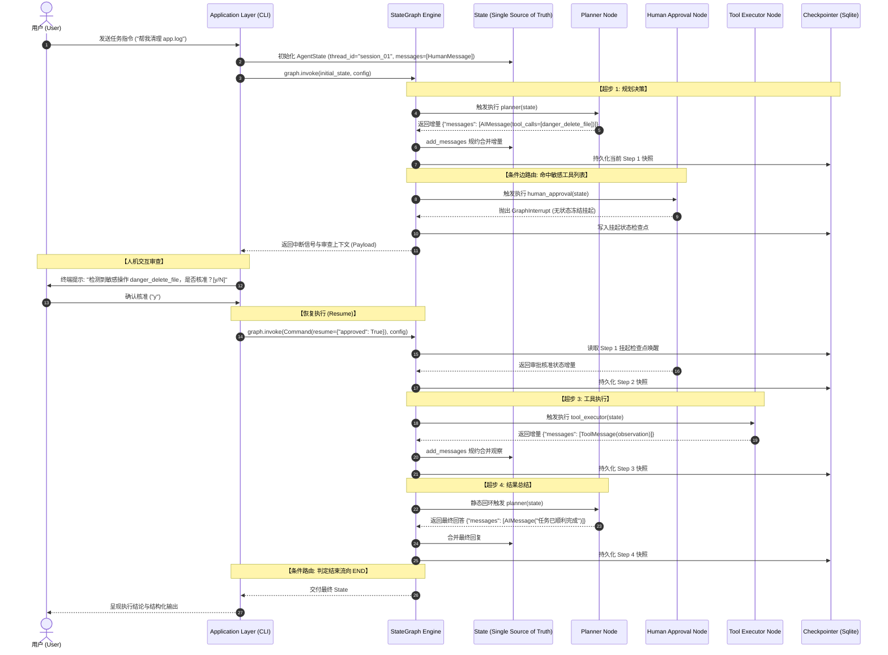
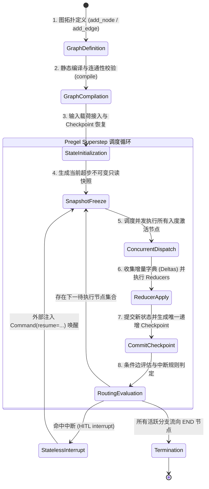

# AgentGraph 系统架构设计 (System Architecture)

> **当前状态**: 已实现 (Implemented - Phase 0~8 + CLI Application Layer)  
> **核心机制**: 基于 LangGraph 的声明式有向状态图与 Pregel 超步执行引擎

---

## 1. 架构定位与设计哲学

AgentGraph 是自主智能体从**命令式运行时循环（Imperative Runtime Loop）**向**声明式图编排系统（Declarative Graph Orchestrator）**演进的工业级参考工程实现。

传统的自主智能体往往依赖一个过程式的 `while` 循环驱动全局逻辑。随着智能体业务复杂度攀升，这种命令式架构暴露出控制流面条化、并发状态竞态、人机协同（HITL）阻塞等待、缺乏细粒度时空状态快照等系统级缺陷。

AgentGraph 采用严格的分层解耦架构，将智能体的“思考、决策、工具调用、人工介入、持久化”全部抽象为**图拓扑（Graph Topology）**与**状态规约（State Reducer）**，从上层应用接口到底层持久化存储，层层确立清晰的工程边界与类型契约。

---

## 2. 分层架构全景 (Layered Architecture)

```
┌─────────────────────────────────────────────────────────────┐
│                    Application Layer                        │
│   (CLI Entrypoint / REPL Session / Task Runner / Web API)   │
└──────────────────────────────┬──────────────────────────────┘
                               │ Ingest User Input & Config
                               ▼
┌─────────────────────────────────────────────────────────────┐
│                    StateGraph Layer                         │
│  (Graph Topology / Compilation / Edges / Conditional Router)│
└──────────────┬───────────────────────────────┬──────────────┘
               │ Invokes Nodes                 │ Reads / Writes
               ▼                               ▼
┌──────────────────────────────┐ ┌─────────────────────────────┐
│         Nodes Layer          │ │         State Layer         │
│   (Planner / Tool / HITL /   │ │  (TypedDict / Reducers /    │
│    Subgraphs / Aggregators)  │ │   Message History / Delta)  │
└──────────────┬───────────────┘ └─────────────────────────────┘
               │ Delegates Execution
               ▼
┌──────────────────────────────┐ ┌─────────────────────────────┐
│         Tools Layer          │ │      LLM Adapter Layer      │
│ (Custom Tools / Shell / FS / │ │  (DemoModel / OpenAI-Compat/│
│  MCP Client / Ext Integr.)   │ │   Prompt Templates / Schemas│
└──────────────┬───────────────┘ └─────────────┬───────────────┘
               │                               │
               └───────────────┬───────────────┘
                               ▼
┌─────────────────────────────────────────────────────────────┐
│                    Infrastructure Layer                     │
│   (SqliteSaver / MemorySaver / Cache / Logging / Auditing)  │
└─────────────────────────────────────────────────────────────┘
```

### 2.1 模块分层职责清单

| 架构层级 | 源码目录 | 核心职责 | 当前实现状态 |
| :--- | :--- | :--- | :--- |
| **Application Layer** | `cli/` | 提供终端交互入口（Typer/Rich），负责参数解析、会话配置、REPL 对话流转与人机审批交互提示。 | **Implemented** |
| **StateGraph Layer** | `graph/` | 维护有向图拓扑，包含图构建器（`builder.py`）、静态连线（`edges.py`）、条件路由（`router.py`）、ReAct 闭环（`react_graph.py`）与 HITL 状态图（`hitl_graph.py`）。 | **Implemented** |
| **Nodes Layer** | `nodes/` | 无状态纯函数/可调用对象节点。提供规划节点（`planner.py`）、工具执行节点（`tool_executor.py`）、人机核准节点（`human_approval.py`）以及异常边界装饰器（`base.py`）。 | **Implemented** |
| **State Layer** | `state/` | 强类型数据模型（`agent_state.py`）。定义 `AgentState` 规范及其配套规约器（`add_messages`、`append_reducer`、`merge_dict_reducer`）。 | **Implemented** |
| **Tools Layer** | `tools/`, `cli/tools.py` | 封装智能体与物理环境交互的具体能力（计算器、系统信息采集、文件读取、模拟高危删除等），声明敏感工具清单 `CLI_SENSITIVE_TOOLS`。 | **Implemented** |
| **LLM Adapter Layer** | `cli/llm_factory.py` | 大语言模型统一适配层。提供离线确定性 Demo 规则桩（`DemoModel`）与基于 `httpx` 的通用 OpenAI 兼容协议客户端（`OpenAICompatibleModel`）。 | **Implemented** |
| **Infrastructure Layer** | `checkpoints/` | 状态持久化与快照管理。提供 `create_sqlite_saver`、`create_memory_saver` 以及用于时间旅行与会话隔离的 `CheckpointManager`。 | **Implemented** |

---

## 3. 典型端到端执行时序 (Execution Sequence)

以下展示一次包含**大模型意图规划 ➔ 敏感操作拦截 ➔ 人工核准 ➔ 工具执行 ➔ 结果反馈**的完整端到端生命周期：



---

## 4. Pregel 超步调度与生命周期 (Superstep Engine Lifecycle)

LangGraph 并非简单的顺序脚本，其内部由基于 Google Pregel 分布式图模型的**超步迭代机（Superstep Engine）**调度。



### 4.1 超步执行各阶段深度说明

1. **图拓扑定义 (Definition)**:
   - 实例化 `builder = StateGraph(AgentState)`。
   - 注册原子计算节点：`builder.add_node("planner", planner_node)`。
   - 声明起始入口（`START`）、终止出口（`END`）、静态边（`add_edge`）与动态条件边（`add_conditional_edges`）。
2. **静态编译校验 (Compilation)**:
   - 触发 `compiled_graph = builder.compile(checkpointer=..., interrupt_before=...)`。
   - 静态校验拓扑完整性：若存在悬空边（Dangling Edge）或未注册的幽灵节点，编译期立即抛出 `ValueError`。
3. **输入载荷与检查点恢复 (Invocation & Recovery)**:
   - 接收用户输入与 `RunnableConfig(configurable={"thread_id": "..."})`。
   - 若数据库存在该 `thread_id` 的历史检查点，框架自底向上恢复最新状态快照；若不存在，则根据 `AgentState` 规范初始化新状态。
4. **只读快照生成 (Frozen Snapshot)**:
   - 每个超步开始时，系统创建当前状态的冻结视图。同一超步内并发调度的多个节点只能读取该完全一致的快照，严禁就地修改。
5. **节点并发分发 (Node Execution)**:
   - 调度器异步并发执行当前激活的节点。节点内部包含异常隔离边界（`with_error_boundary`），确保单个工具崩溃不会导致进程崩溃。
6. **状态规约与增量合并 (Reducer Application)**:
   - 节点仅产出部分字段的差量更新（Delta）。
   - 框架统一遍历差量，交由字段预先绑定的规约器（如 `add_messages`、`append_reducer`）执行原子合并。
7. **检查点提交 (Checkpoint Commit)**:
   - 框架将当前超步规约后的完整状态、Step 计数器、父检查点 ID 写入持久化存储（SQLite），产生不可变时空快照。
8. **边评估与无状态中断 (Routing & Interrupt)**:
   - 执行条件路由函数计算下游节点。
   - 若节点内部触发 `interrupt()`，图引擎立即抛出 `GraphInterrupt` 控制信号，安全挂起执行并持久化上下文，完全释放线程与连接。
9. **图终止 (Termination)**:
   - 当条件边指向 `END` 常量且活动执行队列为空时，图生命周期正常终止，交付最终结果。

---

## 5. 核心工程边界与设计约束

1. **节点纯函数约束 (Pure Functions)**:
   - 节点严禁持有内部可变实例变量。
   - 输入为不可变状态快照，输出必须为字典类型增量更新（`dict[str, Any]`）。
2. **控制流与业务分离**:
   - 节点只负责生产数据，严禁在节点代码内硬编码跳转逻辑。
   - 所有分支流转必须显式交给 `add_conditional_edges` 中的路由函数处理。
3. **异常隔离与控制流放行**:
   - 业务异常必须在节点内部被 `with_error_boundary` 捕获并降级为观察消息。
   - 框架级控制流信号（如 `GraphInterrupt`、`GraphRecursionError`）严禁被普通 `except Exception:` 吞没，必须向上传播给图引擎调度器。
