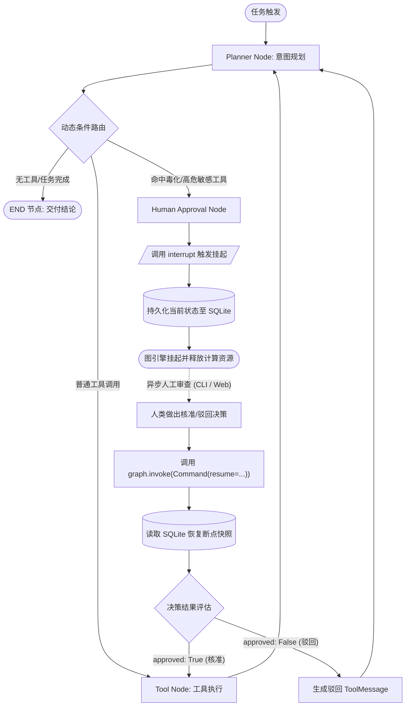

# 人机协同与无状态中断机制 (Human-in-the-Loop & Interrupt)

> **当前状态**: 已实现 (Implemented - Phase 7)  
> **核心机制**: LangGraph 原生 `interrupt()` + `Command(resume=...)` + 敏感工具拦截

---

## 1. 为什么需要无状态中断 (Stateless Interrupt)

在传统的自主智能体系统中，人工审查（HITL）通常采用同步阻塞方式实现：
```python
# 传统阻塞式审查 (严重缺陷)
if is_sensitive(action):
    confirm = input("是否执行? [y/N]")  # 阻塞线程
    if confirm != "y":
        return
```

### 传统阻塞式的三大致命缺陷：
1. **连接与线程资源浪费**: 审批可能需要数分钟甚至数天，独占进程或 Web 连接会导致服务资源耗尽。
2. **无法水平伸缩与容灾**: 服务器重启、容器漂移或负载均衡超时会导致等待中的任务彻底丢失。
3. **不可跨协议恢复**: 命令行发起的任务无法在 Web 端审批，Web 端发起的任务无法在移动端核准。

AgentGraph 彻底摒弃阻塞式模型，采用基于状态机中断原语的**无状态挂起与恢复架构**。

---

## 2. HITL 架构执行模型



---

## 3. 核心技术实现

### 3.1 审批节点实现 (Human Approval Node)
源码位置: `nodes/human_approval.py`

```python
def create_human_approval_node(
    sensitive_tools: list[str] | set[str] | frozenset[str] | None = None,
) -> NodeFunction:
    """创建人工核准节点。"""
    sensitive_set = frozenset(sensitive_tools or DEFAULT_SENSITIVE_TOOLS)

    def human_approval_node(state: AgentState) -> dict[str, Any]:
        # 1. 提取当前待执行工具
        pending = state.get("pending_action")
        tool_name = pending.get("name") if pending else ""

        # 2. 若命中敏感工具列表，调用 LangGraph 原生 interrupt 触发挂起
        if tool_name in sensitive_set:
            interrupt_payload = {
                "type": "human_approval_required",
                "tool_name": tool_name,
                "tool_args": pending.get("args", {}),
                "tool_call_id": pending.get("id"),
                "question": f"智能体请求执行敏感工具 [{tool_name}]，是否核准？",
            }
            # interrupt() 将抛出 GraphInterrupt 异常，状态被自动持久化至 Checkpointer
            resume_data = interrupt(interrupt_payload)

            # 3. 外部恢复执行时，直接从 interrupt() 调用处继续向下执行
            if isinstance(resume_data, dict) and resume_data.get("approved") is True:
                return {
                    "approval_status": "approved",
                    "scratchpad": [f"操作 [{tool_name}] 已由人工审核核准通过。"],
                }
            
            # 驳回分支
            return {
                "approval_status": "rejected",
                "scratchpad": [f"操作 [{tool_name}] 已被人工驳回。"],
            }

        return {"approval_status": "approved"}

    return human_approval_node
```

### 3.2 敏感工具清单管理
源码位置: `cli/tools.py`
```python
# 默认声明的高危操作清单
CLI_SENSITIVE_TOOLS: frozenset[str] = frozenset({
    "danger_delete_file",
    "execute_shell",
})
```

---

## 4. 外部唤醒协议 (Command Resume Protocol)

当图发生中断时，调用端可通过 `Command(resume=...)` 注入审核结果恢复图的执行：

### 4.1 终端用户核准 (Approved)
```python
from langgraph.types import Command

# 注入核准载荷
resume_command = Command(resume={"approved": True, "comment": "同意执行文件清理"})
result = graph.invoke(resume_command, config={"configurable": {"thread_id": "session_1"}})
```
- **后续行为**: 图引擎加载挂起检查点，`approval_status` 置为 `"approved"`，条件边将执行流路由到 `tool_executor` 节点执行真实操作。

### 4.2 终端用户驳回 (Rejected)
```python
# 注入驳回载荷
resume_command = Command(resume={"approved": False, "reason": "禁止清理生产日志"})
result = graph.invoke(resume_command, config={"configurable": {"thread_id": "session_1"}})
```
- **后续行为**: `approval_status` 置为 `"rejected"`，系统构造一条包含驳回说明的 `ToolMessage` 存入 `messages`，条件边将执行流重定向回 `planner` 节点，模型重新规划替代方案。

---

## 5. 异常穿透保证 (Exception Bubbling)

为了保证 `interrupt()` 能够被 LangGraph 图引擎捕获，所有节点的异常隔离包装器（`with_error_boundary`，见 `nodes/base.py`）必须显式识别并放行框架控制流异常：

```python
from langgraph.errors import GraphInterrupt, GraphRecursionError

try:
    return fn(state)
except (GraphInterrupt, GraphRecursionError):
    # 框架控制流异常：坚决不拦截，向上传播给图调度引擎
    raise
except Exception as exc:
    # 业务级普通异常：捕获并封装为友好的观察结果
    return {"scratchpad": [f"节点执行失败: {exc}"]}
```
此设计保证了人机协同控制流信号永远不会被业务代码中的通用异常捕获吞没。
