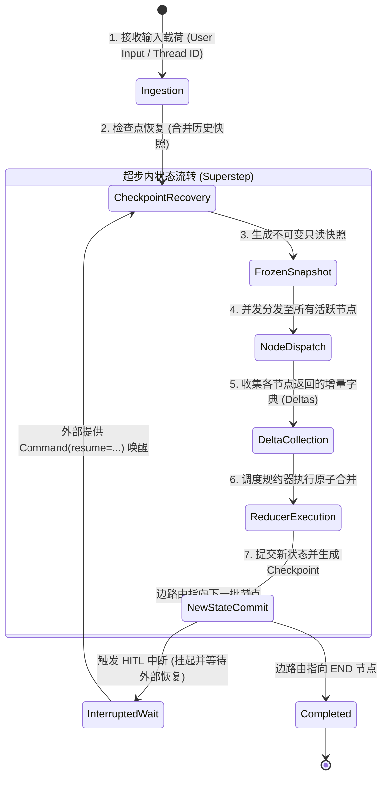

# AgentGraph 状态设计规范 (State Design)

> **当前状态**: 已实现 (Implemented - Phase 3)  
> **核心机制**: TypedDict + 声明式规约器 (Reducers) + 不可变快照

---

## 1. 核心设计原则

在 AgentGraph 中，**状态（State）** 是整个图的单一可信数据源（Single Source of Truth），也是节点之间通信的唯一载体。

1. **节点不持有私有业务状态**: 节点退化为纯函数或只读消费者，输入当前状态切片，仅输出增量差量（Partial Delta）。
2. **状态更新基于函数式规约器（Reducers）**: 禁止原地修改，更新行为由强类型字段注解绑定的 Reducer 函数确定性处理。
3. **快照不可变性**: 每个超步开始前生成只读冻结快照，并发节点读取完全一致的数据视图。

---

## 2. 状态生命周期 (State Lifecycle)



---

## 3. 状态结构定义 (AgentState Schema)

源码位置: `state/agent_state.py`

```python
from collections.abc import Sequence
from typing import Annotated, Any, Literal
from typing_extensions import TypedDict
from langchain_core.messages import BaseMessage
from langgraph.graph.message import add_messages


def append_reducer(
    existing: list[Any] | None, update: Any | list[Any] | None
) -> list[Any]:
    """自定义追加规约器：支持元素单体或列表追加。"""
    existing_list = list(existing) if existing else []
    if update is None:
        return existing_list
    if isinstance(update, list):
        return existing_list + update
    return existing_list + [update]


def merge_dict_reducer(
    existing: dict[str, Any] | None, update: dict[str, Any] | None
) -> dict[str, Any]:
    """字典规约器：合并字典并覆写相同键。"""
    result = dict(existing) if existing else {}
    if update:
        result.update(update)
    return result


class AgentState(TypedDict):
    """
    AgentGraph 核心图状态模型 (单一可信数据源)
    """

    # 1. 消息流历史 (使用 LangGraph 官方 add_messages 规约，支持追加、ID覆盖更新与删除)
    messages: Annotated[Sequence[BaseMessage], add_messages]

    # 2. 任务总目标 (一次图会话生命周期内保持稳定)
    task_goal: str

    # 3. 规划与拆解状态 (当前活动计划与子步骤，默认覆盖更新)
    plan: dict[str, Any] | None

    # 4. 待执行或正在审批的动作载荷 (包含工具名与参数)
    pending_action: dict[str, Any] | None

    # 5. 人机协同审批标志: None | 'pending' | 'approved' | 'rejected'
    approval_status: Literal["pending", "approved", "rejected"] | None

    # 6. 工作暂存草稿本 (采用 append_reducer，允许节点按序追加思考与观察)
    scratchpad: Annotated[list[str], append_reducer]

    # 7. 并发分支聚合区 (采用 merge_dict_reducer，供未来并行扇入安全合并)
    branch_results: Annotated[dict[str, Any], merge_dict_reducer]

    # 8. 运行时元数据 (记录会话配置、版本号等)
    metadata: dict[str, Any]
```

---

## 4. 规约器模式与更新规则

| 字段名称 | 规约器类型 | 行为说明 | 典型触发节点 |
| :--- | :--- | :--- | :--- |
| `messages` | `add_messages` | 1. 遇到新 ID 消息：追加到列表尾部。<br>2. 遇到相同 ID 消息：原地覆盖更新（用于流式补全）。<br>3. 遇到 `RemoveMessage(id=...)`：物理移除该消息。 | `planner`, `tool_executor` |
| `scratchpad` | `append_reducer` | 无论传入单个字符串还是字符串列表，均追加到现有列表末尾，保留完整的执行思考轨迹。 | `planner`, `tool_executor` |
| `branch_results` | `merge_dict_reducer` | 执行浅层字典合并（`{**existing, **update}`），为 Phase 10 并行分支的扇入汇聚提供无锁合并。 | 并行分支节点、汇聚节点 |
| `task_goal`, `plan`, `pending_action`, `approval_status` | 默认覆盖 (No Reducer) | 无规约函数标注，节点返回的新值直接覆盖旧值。若节点返回 `None` 则覆盖为 `None`，不返回该字段则保留原值。 | 各计算节点 |

---

## 5. 并发写安全与冲突解决矩阵

在多节点并发激活场景（如后续 Phase 10 扇出架构）中，多个节点会在同一个超步中向 State 提交增量：

```
                    节点 A 输出: {"scratchpad": ["A 完成"], "branch_results": {"a": 1}}
                                             │
                                             ▼
节点 B 输出: {"scratchpad": ["B 完成"], "branch_results": {"b": 2}}
                                             │
                                             ▼
                                  [框架 Superstep 汇聚]
                                             │
                                             ▼
                           执行 Reducers 排序并应用规约:
           - scratchpad: append_reducer -> ["A 完成", "B 完成"]
           - branch_results: merge_dict_reducer -> {"a": 1, "b": 2}
```

### 确定性合并守则
1. **可交换律（Commutative）保障**: 并发节点写入的字段必须配置支持交换律的规约器（如 `append_reducer`、`merge_dict_reducer`），无论节点完成先后，最终状态完全一致。
2. **禁止并发覆写无 Reducer 字段**: 若两个并发节点在同一超步中同时更新无 Reducer 的字段（如 `plan`），会导致竞态覆盖。架构层面严禁在并发分支中同时修改非规约字段。

---

## 6. 上下文压缩与修剪规范 (State Compaction)

随着智能体运行轮次增加，`messages` 列表会持续膨胀。AgentGraph 预留两种修剪路径：
1. **物理删除 (RemoveMessage)**:
   ```python
   from langchain_core.messages import RemoveMessage
   return {"messages": [RemoveMessage(id="msg_old_id")]}
   ```
2. **摘要折叠 (Summarization Node)**:
   当消息数超过阈值时，路由至摘要节点，将旧轮次折叠为 `SystemMessage(content="前情摘要...")`，并批量移除已压缩的旧消息，确保模型推理始终处于安全 Token 窗口内。
