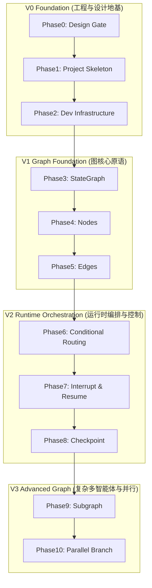

# Jarvis Agent Pro 路线图 (Roadmap)

## 1. 概述与核心哲学

Jarvis Agent Pro 是 **Jarvis Agent**（基于自研 Runtime Loop 的智能体系统）向 **LangGraph** 图编排架构演进的参考迁移实现（Reference Migration）。

本项目并非推翻原有认知重写 Jarvis，而是建立从 **Runtime Loop** 到 **Graph Orchestration** 的精准概念演进与工程对齐。通过 10 个精心规划的阶段（Phase0 ~ Phase10），从基础架构到高级图原语，逐层建立系统化心智模型与生产级代码基。

---

## 2. 阶段全景总览 (V0 ~ V3)

---

## 3. 分阶段详细设计

### Phase 0: Design Gate (已完成 - Completed)
- **Goal**: 确立系统架构设计、概念迁移映射、状态设计与工程规范，在写入任何生产代码前筑牢架构共识。
- **Deliverables**:
  - `README.md`
  - `docs/roadmap.md`
  - `docs/architecture.md`
  - `docs/graph-migration.md`
  - `docs/state-design.md`
  - `docs/engineering-plan.md`
  - `docs/adr/ADR-001-why-langgraph.md`
  - `docs/adr/ADR-002-stategraph-first.md`
  - `docs/adr/ADR-003-loop-to-graph.md`
- **Learning Focus**: 
  - 明确 Graph 编排与命令式 Runtime Loop 的核心哲学差异。
  - 理解 State 作为图的一等公民（First-class Citizen）与单一可信数据源（Single Source of Truth）。
- **Jarvis 对照**:
  - Jarvis: 在代码中通过 `AgentRuntime.run()` 隐式控制循环逻辑与状态流动。
  - LangGraph: 显式拓扑结构（Topology）、声明式状态规约（State Reducer）与状态转移约束。
- **Expected Git Diff**: 文档目录 `docs/` 与 `README.md`，新增纯 Markdown 文档约 1200+ 行，零代码行。
- **Quality Gate**:
  - 架构文档齐备，ADR 论证清晰。[PASS]
  - 明确从 Loop 到 Graph 的迁移映射无概念模糊。[PASS]
  - 评审通过，严禁包含任何 Node/Graph 业务代码。[PASS]

---

### Phase 1: Project Skeleton (已完成 - Completed)
- **Goal**: 搭建标准现代化 Python 工程结构，确立包布局、模块隔离与模块依赖边界。
- **Deliverables**:
  - `pyproject.toml` (定义包元数据与依赖组)
  - `.gitignore` (Python/IDE/uv/checkpoints 过滤规则)
  - 目录包声明：`graph/`、`nodes/`、`state/`、`tools/`、`checkpoints/`、`tests/` 下的 `__init__.py`
  - 基础版本定义与根模块暴露
  - `tests/test_skeleton.py` (包导入与分层隔离测试)
- **Learning Focus**:
  - 理解分层图架构的包划分：`state/`（纯数据模型）、`nodes/`（业务计算逻辑）、`graph/`（拓扑组装编排）。
- **Jarvis 对照**:
  - Jarvis: 传统模块划分（`agent/runtime.py`、`agent/memory.py`、`agent/planner.py`）。
  - LangGraph: 解耦为图元素与状态系统（`state/`、`nodes/`、`graph/`）。
- **Expected Git Diff**: 约 100~200 行配置与基础骨架。
- **Quality Gate**:
  - `uv sync` / `uv run` 环境正常解析并安装依赖。[PASS]
  - 模块导入无循环依赖（Circular Import），7 项套件测试全绿。[PASS]

---

### Phase 2: Development Infrastructure (已完成 - Completed)
- **Goal**: 配置现代化工程工具链，保障代码质量、静态类型检查、代码风格统一以及测试基准。
- **Deliverables**:
  - 代码风格与 Linting 工具：`pyproject.toml` 中配置严格的 Ruff (Lint & Black 兼容 Format) 规则。
  - 类型检查配置：`pyproject.toml` [tool.mypy] 开启严格静态类型校验。
  - 测试套件骨架：`tests/conftest.py`，提供消息工厂（Human/AI/Tool）与 `RunnableConfig` 线程固件。
  - 基础设施自检测试：`tests/test_infra.py`，覆盖固件行为、TypedDict 自省与 LangGraph 依赖加载。
  - 质量门禁自动化脚本：`scripts/check.py`，一键运行 Lint、Format、Mypy、Pytest。
- **Learning Focus**:
  - TypedDict 与 LangGraph Generic State 的静态类型提示与校验机制。
- **Jarvis 对照**:
  - Jarvis: 动态字典或者简单的 Pydantic 模型传递，缺乏图维度的类型安全。
  - LangGraph: `StateGraph(state_schema)` 依赖强类型系统在编译期捕获状态不匹配缺陷。
- **Expected Git Diff**: 约 150~250 行工程配置文件与基础测试环境。
- **Quality Gate**:
  - `ruff check .` 与 `ruff format --check .` 100% 通过。[PASS]
  - `mypy` 9 个源码文件严格类型推导 100% 通过。[PASS]
  - `pytest -v` 13 项单元测试全量通过。[PASS]
  - `scripts/check.py` 一键门禁自动化验证 100% 成功。[PASS]

---

### Phase 3: StateGraph (已完成 - Completed)
- **Goal**: 引入 LangGraph 核心对象 `StateGraph`，掌握图的创建、State 规约（Reducer）机制与编译（Compile）过程。
- **Deliverables**:
  - `state/agent_state.py`: 定义 `AgentState`（TypedDict）及 `add_messages`、`append_reducer`、`merge_dict_reducer`。
  - `state/__init__.py`: 规范暴露状态核心类型与规约器函数。
  - `graph/builder.py`: 基础 `StateGraph` 实例化 `create_agent_graph_builder` 与编译封装 `compile_agent_graph`。
  - `graph/__init__.py`: 规范暴露图构建与编译契约。
  - `tests/test_state_graph.py`: 状态字段自省、规约器单元测试、add_messages 行为与编译后 `CompiledStateGraph` 冒烟测试。
- **Learning Focus**:
  - 为什么 State 是 LangGraph 的核心？
  - Reducer 机制（`Annotated[list, add_messages]` 或自定义规约）如何保证并发一致性与历史增量更新。
- **Jarvis 对照**:
  - Jarvis: `state.messages.append(...)` 手动命令式变更，容易出现脏写与历史覆盖。
  - LangGraph: 纯函数式 Reducer，Node 只返回 delta（差量），由框架原子化合并。
- **Expected Git Diff**: 约 200~350 行核心状态模型与状态图构建代码。
- **Quality Gate**:
  - 状态 Reducer 单元测试覆盖率 100%（涵盖单元素追加、列表扩展、None 处理、字典合并覆盖、add_messages 原地更新与删除）。[PASS]
  - `graph.compile()` 无异常，通过基本图生命周期与状态累加调用冒烟测试。[PASS]
  - 全流程门禁校验 100% 通过（Lint, Format, Mypy, 19 项单元测试通过）。[PASS]

---

### Phase 4: Nodes (已完成 - Completed)
- **Goal**: 实现功能原子化节点（Nodes），将业务与推理逻辑封装为纯函数或异步可调用对象（Callable）。
- **Deliverables**:
  - `nodes/base.py`: 节点接口定义 `NodeFunction` 与统一异常隔离装饰器 `with_error_boundary`。
  - `nodes/planner.py`: 负责理解意图、规划步骤并生成决策的 Planner 节点工厂 `create_planner_node`。
  - `nodes/tool_executor.py`: 执行具体工具动作的 Tool Node 工厂 `create_tool_node`（支持本地工具注册与字典分发）。
  - `nodes/__init__.py`: 规范暴露节点计算层工厂与契约。
  - `tests/test_nodes.py`: 针对各节点的隔离单测（全 Mock，覆盖直接答复、工具调用、系统提示词注入、未知工具安全兜底、运行期异常捕获与纯函数无副作用约束）。
- **Learning Focus**:
  - Node 的输入是完整只读 State 快照，输出是状态增量字典 `Dict[str, Any]`。
  - 节点幂等性与纯函数设计对可靠重试的重要性。
- **Jarvis 对照**:
  - Jarvis: `runtime.step()` 中直接调用 LLM，并在主逻辑里混杂工具调度。
  - LangGraph: 每个计算单元退化为 `Node(state) -> partial_state`，具备极高的可测试性与隔离性。
- **Expected Git Diff**: 约 250~450 行节点实现代码与单元测试。
- **Quality Gate**:
  - 节点入参与出参严格契合 `AgentState` 约束，无就地修改污染。[PASS]
  - 所有节点单测通过且无外部网络硬依赖（全 Mock，7 项针对性单测）。[PASS]
  - 全流程门禁校验 100% 通过（Lint, Format, Mypy, 26 项单元测试全部通过）。[PASS]

---

### Phase 5: Edges
- **Goal**: 掌握静态边（Normal Edge）与图流转，将孤立的 Node 连接成线性和闭环链路。
- **Deliverables**:
  - `graph/edges.py`: 边连接逻辑与拓扑声明。
  - 连接 `START -> planner -> tool_executor -> END` 等静态流程。
  - `tests/test_static_edges.py`: 静态边拓扑遍历与执行流测试。
- **Learning Focus**:
  - LangGraph 中的特殊常量节点：`START` 与 `END`。
  - 拓扑关系的声明式组装与有向无环/有向有环图的连通性校验。
- **Jarvis 对照**:
  - Jarvis: 在 `while True:` 中通过 `if-else` 或硬编码代码顺序跳转下一步。
  - LangGraph: `builder.add_edge("node_a", "node_b")`，逻辑流动与执行拓扑彻底解耦。
- **Expected Git Diff**: 约 200~300 行拓扑组装与拓扑连通测试。
- **Quality Gate**:
  - 拓扑校验正确，节点按预期顺序静态推进。
  - 图可通过 Mermaid 图格式导出验证（`graph.get_graph().draw_mermaid()`）。

---

### Phase 6: Conditional Routing
- **Goal**: 实现条件边（Conditional Edge），实现基于状态智能决策的动态分支路由与循环反馈。
- **Deliverables**:
  - `graph/router.py`: 路由函数（Router function），根据 Planner 输出决定走向 Tool 还是直接 Finish。
  - `builder.add_conditional_edges()` 完整接入图拓扑。
  - `tests/test_conditional_routing.py`: 覆盖分支路由、死循环防护（Max Iterations）测试。
- **Learning Focus**:
  - 条件边函数签名 `router(state) -> Literal["tools", "end"]`。
  - 基于 Graph 的 ReAct 模式循环闭环机制。
- **Jarvis 对照**:
  - Jarvis: `if response.has_tool_call: execute(); continue; else: break` 侵入式控制流。
  - LangGraph: 声明式条件路由，清晰分离“状态决策”与“分支跳转”。
- **Expected Git Diff**: 约 250~400 行条件路由、循环控制与测试。
- **Quality Gate**:
  - 条件覆盖包含工具调用、直接回复、异常降级分支。
  - 循环调用具备最大递归深度保护机制（Recursion Limit / Safety Guard）。

---

### Phase 7: Interrupt & Resume
- **Goal**: 掌握人机协同（Human-in-the-Loop, HITL）机制，实现执行中断（Interrupt）与状态恢复（Resume）。
- **Deliverables**:
  - `nodes/human_approval.py`: 人工审批或确认节点，触发中断。
  - `graph/hitl_graph.py`: 配置 `interrupt_before` / `interrupt_after` 或动态 `interrupt()`。
  - `tests/test_interrupt_resume.py`: 模拟执行中断、外挂注入人工输入、从中断点无损恢复继续执行。
- **Learning Focus**:
  - 框架如何在不阻塞进程/线程的情况下挂起图执行。
  - 外部如何通过 `update_state` 修改图状态后发出恢复指令。
- **Jarvis 对照**:
  - Jarvis: 传统交互往往通过命令行 `input()` 阻塞等待，或者在 Web API 中轮询阻塞线程，难以跨服务恢复。
  - LangGraph: 图在中断边界自动持久化冻结，支持异步、无状态 Web 服务的原生 HITL。
- **Expected Git Diff**: 约 300~450 行中断恢复逻辑与端到端测试。
- **Quality Gate**:
  - 中断发生时，图执行安全暂停且保留全部上下文。
  - 状态恢复后严格从中断节点继续运行，无重复计算或状态丢失。

---

### Phase 8: Checkpoint
- **Goal**: 集成持久化检查点系统（Checkpointer），实现时间旅行（Time Travel）、故障恢复与会话管理。
- **Deliverables**:
  - `checkpoints/manager.py`: 抽象 Checkpointer 存储适配（MemorySaver / SqliteSaver）。
  - `graph/checkpointed_graph.py`: 注入持久化机制，支持基于 `thread_id` 的多租户会话隔离。
  - `tests/test_checkpoint.py`: 测试状态历史追溯（Get State History）、状态分支分叉（Forking）、回滚重试。
- **Learning Focus**:
  - Checkpoint、Checkpoint Metadata 与 State Versions 的底层存储结构。
  - 为什么 Checkpoint 远胜于普通 Chat Memory（它保存了整个状态图的完整系统快照）。
- **Jarvis 对照**:
  - Jarvis: 仅存储单维度的 `messages` 列表或简单向量库记忆，无法回溯完整的内部中间变量。
  - LangGraph: 拥有图每一步步进的完整快照，原生支持“时间旅行”与步级审计。
- **Expected Git Diff**: 约 250~450 行 Checkpointer 配置与历史追溯测试。
- **Quality Gate**:
  - 多 `thread_id` 状态严格隔离。
  - 验证可在任意历史 step 执行分叉执行并产生预期分支。

---

### Phase 9: Subgraph
- **Goal**: 掌握子图（Subgraph）模式，实现分层多智能体编排（Hierarchical Multi-Agent）与复杂流程模块化。
- **Deliverables**:
  - `graph/subgraphs/researcher.py`: 具备独立状态空间与循环的 Researcher 子图。
  - `graph/subgraphs/coder.py`: 独立的 Coder 子图。
  - `graph/parent_graph.py`: 主图（Supervisor / Orchestrator）调用并协同子图。
  - `tests/test_subgraph.py`: 父子图状态映射、隔离性与联动集成测试。
- **Learning Focus**:
  - 子图如何作为一个普通节点（Node）嵌入父图。
  - 父图 State 与子图 State 的模式隔离、转换与结果规约传递。
- **Jarvis 对照**:
  - Jarvis: 引入新角色时直接在一个庞大主循环中堆砌 `if agent_type == 'researcher'`，耦合严重。
  - LangGraph: 子图拥有独立的状态图拓扑与生命周期，遵循黑盒组件化原则。
- **Expected Git Diff**: 约 350~500 行子图定义、父图编排与多智能体测试。
- **Quality Gate**:
  - 子图内部状态不对外污染。
  - 父图清晰观测到子图的完整执行周期。

---

### Phase 10: Parallel Branch
- **Goal**: 实现图的扇出（Fan-out）与扇入（Fan-in）并行分支编排，解锁并发任务处理能力。
- **Deliverables**:
  - `graph/parallel_graph.py`: 一个触发点同时发出多条指向不同 Node 的静态/动态边。
  - `nodes/aggregators.py`: 汇聚节点（Reducer/Aggregator），收集所有并行分支的状态并聚合。
  - `tests/test_parallel_branch.py`: 并发正确性测试、竞态分析与耗时加速基准测试。
- **Learning Focus**:
  - 异步事件循环下多节点的并发触发机制。
  - 并发节点向 State 返回更新时，Reducer 是如何解决写冲突（Concurrent Write Conflict）并确保顺序决定论（Determinism）的。
- **Jarvis 对照**:
  - Jarvis: 传统 Runtime Loop 必须手动启动 `asyncio.gather` 并编写复杂的结果等待与字典合并代码。
  - LangGraph: 通过图拓扑原生声明扇出边，框架自动并行分发并在汇聚节点通过 Reducer 安全合并。
- **Expected Git Diff**: 约 300~500 行并行拓扑构建、汇聚逻辑与并发压力测试。
- **Quality Gate**:
  - 并行执行时无竞态数据丢失。
  - 所有分支结果完整汇聚至最终状态。

---

## 4. 阶段演进矩阵表

| Phase | 版本阶段 | 核心原语/机制 | 代码行数预期 | 核心测试重点 |
| :--- | :--- | :--- | :--- | :--- |
| **Phase 0** | V0 Foundation | 架构文档 / ADR / 迁移映射 | 0 (文档 1200+) | 设计完整度评审 |
| **Phase 1** | V0 Foundation | 包规范 / 依赖配置 / 模块骨架 | ~150 | 包导入与依赖解析 |
| **Phase 2** | V0 Foundation | Ruff / Black / Mypy / Pytest 基建 | ~200 | Lint / Format / 单测套件 |
| **Phase 3** | V1 Graph Foundation | StateGraph / Reducer 规约 | ~300 | 状态增量更新原子性 |
| **Phase 4** | V1 Graph Foundation | Planner & Tool Callable Nodes | ~350 | 纯函数节点隔离与 Mock |
| **Phase 5** | V1 Graph Foundation | Normal Edges / START & END | ~250 | 拓扑连通性与执行顺序 |
| **Phase 6** | V2 Runtime Orchestration | Conditional Edge / Routing | ~350 | 分支决策与防死循环 |
| **Phase 7** | V2 Runtime Orchestration | Interrupt / Resume / HITL | ~400 | 中断挂起与无损恢复 |
| **Phase 8** | V2 Runtime Orchestration | Checkpointer / Time Travel | ~350 | 历史快照与版本追溯 |
| **Phase 9** | V3 Advanced Graph | Subgraph / Multi-Agent | ~450 | 状态隔离与分层协同 |
| **Phase 10** | V3 Advanced Graph | Fan-out / Fan-in / Parallel Reducer | ~400 | 并发执行与无锁写合并 |
