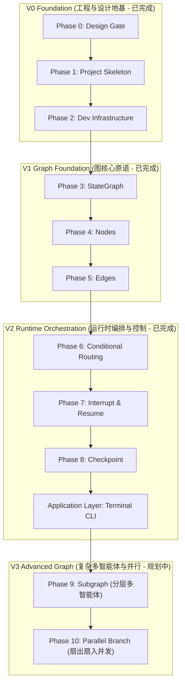

# AgentGraph 工程演进路线图 (Roadmap)

> **当前阶段**: **V2 运行时编排与持久化已就绪 (Phase 0 ~ Phase 8 + CLI Completed)**  
> **下一目标**: **V3 高阶图与多智能体拓扑 (Phase 9 Subgraph & Phase 10 Parallel Branch)**

---

## 1. 路线图总览与阶段划分

AgentGraph 将智能体系统的图化重构拆解为四大版本、十个递进阶段，严格遵守“先设计后编码、一个阶段一个能力验证、测试驱动”的软件工程纪律。

---

## 2. 详细演进阶段清单与状态

### 2.1 V0 Foundation (工程与设计地基)

#### Phase 0: Design Gate
- **状态**: **Completed (已完成)**
- **核心目标**: 确立架构全景设计、概念迁移映射、状态设计与工程规范，在写入业务代码前筑牢架构共识。
- **交付物**:
  - `README.md`
  - `docs/architecture/system-architecture.md`
  - `docs/architecture/graph-migration.md`
  - `docs/design/state-design.md`
  - `docs/development/engineering-guide.md`
  - `docs/adr/ADR-001-why-langgraph.md`
  - `docs/adr/ADR-002-stategraph-first.md`
  - `docs/adr/ADR-003-loop-to-graph.md`
- **质量门禁**: 架构全景完备，ADR 论证清晰，零生产代码入侵。[PASS]

#### Phase 1: Project Skeleton
- **状态**: **Completed (已完成)**
- **核心目标**: 搭建标准现代化 Python 工程结构，确立包布局、模块隔离与模块依赖边界。
- **交付物**:
  - `pyproject.toml` (定义包元数据与依赖组)
  - `.gitignore` (Python/IDE/uv/checkpoints 过滤规则)
  - 核心包骨架：`graph/`、`nodes/`、`state/`、`tools/`、`checkpoints/`、`tests/`
  - `tests/test_skeleton.py` (包导入与分层隔离测试，7 项测试全绿)
- **质量门禁**: `uv sync` / `uv run` 环境正常解析，分层隔离无循环导入。[PASS]

#### Phase 2: Development Infrastructure
- **状态**: **Completed (已完成)**
- **核心目标**: 配置工程工具链，保障代码质量、静态类型检查、代码风格统一以及测试基准。
- **交付物**:
  - 代码风格与 Linting：`pyproject.toml` 中配置严格的 Ruff 规则
  - 类型检查配置：`pyproject.toml` [tool.mypy] 开启严格静态类型推导
  - 测试固件基础设施：`tests/conftest.py` 提供消息工厂与 mock 设施
  - 自动化门禁脚本：`scripts/check.py`
  - `tests/test_infra.py` (6 项基础设施测试全绿)
- **质量门禁**: Lint、Format、Mypy、Pytest 门禁脚本一次性通过。[PASS]

---

### 2.2 V1 Graph Foundation (图核心原语)

#### Phase 3: StateGraph
- **状态**: **Completed (已完成)**
- **核心目标**: 引入 LangGraph 核心对象 `StateGraph`，掌握图的创建、State 规约（Reducer）机制与编译（Compile）过程。
- **交付物**:
  - `state/agent_state.py`: 定义 `AgentState` 及 `append_reducer`、`merge_dict_reducer`
  - `graph/builder.py`: 封装图构建器与编译函数
  - `tests/test_state_graph.py` (6 项状态规约测试全绿)
- **质量门禁**: 规约器原子合并无脏写，编译期状态模式校验通过。[PASS]

#### Phase 4: Nodes
- **状态**: **Completed (已完成)**
- **核心目标**: 实现原子化计算节点，将业务与推理逻辑封装为纯函数或异步可调用对象（Callable）。
- **交付物**:
  - `nodes/base.py`: 节点接口定义与 `with_error_boundary` 异常隔离装饰器
  - `nodes/planner.py`: Planner 规划节点工厂
  - `nodes/tool_executor.py`: 工具执行节点工厂
  - `tests/test_nodes.py` (7 项节点单测全绿，纯函数无副作用)
- **质量门禁**: 节点输入只读快照、输出增量字典契约 100% 遵守。[PASS]

#### Phase 5: Edges
- **状态**: **Completed (已完成)**
- **核心目标**: 掌握静态边（Normal Edge）与图流转，将孤立的 Node 连接成线性和闭环链路。
- **交付物**:
  - `graph/edges.py`: `connect_sequence`、`build_linear_agent_graph`、`export_mermaid_diagram`
  - `tests/test_static_edges.py` (6 项静态边拓扑与 Mermaid 导出测试全绿)
- **质量门禁**: 拓扑连通性校验正确，非法连线在编译期被拦截抛出 `ValueError`。[PASS]

---

### 2.3 V2 Runtime Orchestration (运行时编排与控制)

#### Phase 6: Conditional Routing
- **状态**: **Completed (已完成)**
- **核心目标**: 实现条件边（Conditional Edge），实现基于状态智能决策的动态分支路由与 ReAct 反馈循环。
- **交付物**:
  - `graph/router.py`: `route_planner_decision` 及常量定义
  - `graph/react_graph.py`: ReAct 自适应闭环图工厂 `build_react_agent_graph`
  - `examples/simple_cli.py`: 原型交互演示脚本
  - `tests/test_conditional_routing.py` (4 项条件路由与防死循环测试全绿)
- **质量门禁**: 递归深度保护熔断测试通过，ReAct 轨迹闭环无死锁。[PASS]

#### Phase 7: Interrupt & Resume
- **状态**: **Completed (已完成)**
- **核心目标**: 掌握人机协同（Human-in-the-Loop, HITL）机制，实现执行中断（Interrupt）与外部恢复（Resume）。
- **交付物**:
  - `nodes/human_approval.py`: `create_human_approval_node` (基于 `interrupt()`)
  - `graph/hitl_graph.py`: 组装带核准流的图工厂 `build_hitl_agent_graph`
  - `tests/test_interrupt_resume.py` (4 项核准/驳回双向单测全绿)
- **质量门禁**: 敏感工具绝不提前触发，外部注入指令无损复苏。[PASS]

#### Phase 8: Checkpoint
- **状态**: **Completed (已完成)**
- **核心目标**: 集成持久化检查点系统（Checkpointer），实现时间旅行（Time Travel）、故障恢复与会话管理。
- **交付物**:
  - `checkpoints/manager.py`: `create_memory_saver`、`create_sqlite_saver`、`CheckpointManager`
  - `graph/checkpointed_graph.py`: 检查点挂载工具
  - `tests/test_checkpoint.py` (4 项会话隔离与时间旅行测试全绿)
- **质量门禁**: 多租户 `thread_id` 严格隔离，支持任意历史超步分叉推演。[PASS]

#### Application Layer: Terminal CLI
- **状态**: **Completed (已完成)**
- **核心目标**: 构建工业级终端命令行交互工具，串联全系统能力并提供开箱即用体验。
- **交付物**:
  - `cli/app.py`: `chat`, `run`, `sessions`, `version` 完整子命令
  - `cli/session.py`: 运行时装配与会话生命周期管理
  - `cli/llm_factory.py`: `DemoModel` (零 Key 确定性离线模型) 与 `OpenAICompatibleModel`
  - `cli/tools.py`: 基础工具集与高危工具拦截注册
  - `cli/ui.py`: Rich 终端界面与状态卡片渲染
  - `tests/test_cli.py` (12 项 CLI 交互与参数覆盖测试全绿)
- **质量门禁**: 56 项全套测试全绿，支持离线开箱即用。[PASS]

---

### 2.4 V3 Advanced Graph (复杂多智能体与并行 - 规划中)

#### Phase 9: Subgraph (分层多智能体与子图隔离)
- **状态**: **Planned (计划中)**
- **核心目标**: 掌握子图（Subgraph）模式，实现分层多智能体编排（Hierarchical Multi-Agent）与复杂流程模块化黑盒封装。
- **计划交付物**:
  - `graph/subgraphs/researcher.py`: 具备独立内部状态空间与探索循环的 Researcher 调研子图。
  - `graph/subgraphs/coder.py`: 专职代码生成的独立 Coder 子图。
  - `graph/parent_graph.py`: 主图主管（Supervisor / Orchestrator）调用并协同子图。
  - `tests/test_subgraph.py`: 父子图状态映射、命名空间隔离与联动集成测试。
- **学习与架构关注点**:
  - 子图如何作为一个普通节点（Node）嵌入父图。
  - 父图 State 与子图 State 的模式隔离、转换与结果规约传递。
  - 子图专属 Checkpoint 作用域与中断冒泡行为。
- **质量门禁预期**:
  - 子图内部状态高频变动不对外污染父图上下文。
  - 父图能清晰观测到子图的完整执行周期。

#### Phase 10: Parallel Branch (扇出扇入并发编排)
- **状态**: **Planned (计划中)**
- **核心目标**: 实现图的扇出（Fan-out）与扇入（Fan-in）并行分支编排，解锁原生无锁并发任务处理能力。
- **计划交付物**:
  - `graph/parallel_graph.py`: 单一超步向多个独立节点并发分发静态边。
  - `nodes/aggregators.py`: 汇聚节点（Reducer/Aggregator），收集所有并行分支的结果字典。
  - `tests/test_parallel_branch.py`: 并发正确性测试、竞态分析与耗时加速基准测试。
- **学习与架构关注点**:
  - 异步事件循环下多节点的并发触发机制。
  - 并发节点向 State 返回更新时，Reducer 是如何解决写冲突并保证顺序决定论（Determinism）的。
- **质量门禁预期**:
  - 并行执行时无竞态数据丢失。
  - 所有分支结果完整汇聚至最终状态。

---

## 3. 演进矩阵统计表

| Phase | 版本阶段 | 核心机制 | 状态 | 核心测试套件 |
| :--- | :--- | :--- | :--- | :--- |
| **Phase 0** | V0 Foundation | 架构文档 / ADR / 迁移映射 | **Completed** | 架构评审通过 |
| **Phase 1** | V0 Foundation | 包规范 / 依赖配置 / 模块骨架 | **Completed** | `tests/test_skeleton.py` (7 tests) |
| **Phase 2** | V0 Foundation | Ruff / Mypy / Pytest 基建 | **Completed** | `tests/test_infra.py` (6 tests) |
| **Phase 3** | V1 Graph Foundation | StateGraph / Reducer 规约 | **Completed** | `tests/test_state_graph.py` (6 tests) |
| **Phase 4** | V1 Graph Foundation | Planner & Tool Callable Nodes | **Completed** | `tests/test_nodes.py` (7 tests) |
| **Phase 5** | V1 Graph Foundation | Normal Edges / START & END | **Completed** | `tests/test_static_edges.py` (6 tests) |
| **Phase 6** | V2 Runtime Orchestration | Conditional Edge / ReAct Loop | **Completed** | `tests/test_conditional_routing.py` (4 tests) |
| **Phase 7** | V2 Runtime Orchestration | Interrupt / Resume / HITL | **Completed** | `tests/test_interrupt_resume.py` (4 tests) |
| **Phase 8** | V2 Runtime Orchestration | Checkpointer / Time Travel | **Completed** | `tests/test_checkpoint.py` (4 tests) |
| **CLI** | Application Layer | Terminal REPL / Tasks / Sessions | **Completed** | `tests/test_cli.py` (12 tests) |
| **Phase 9** | V3 Advanced Graph | Subgraph / Multi-Agent | **Planned** | `tests/test_subgraph.py` (待建) |
| **Phase 10** | V3 Advanced Graph | Fan-out / Fan-in / Parallel Reducer | **Planned** | `tests/test_parallel_branch.py` (待建) |
