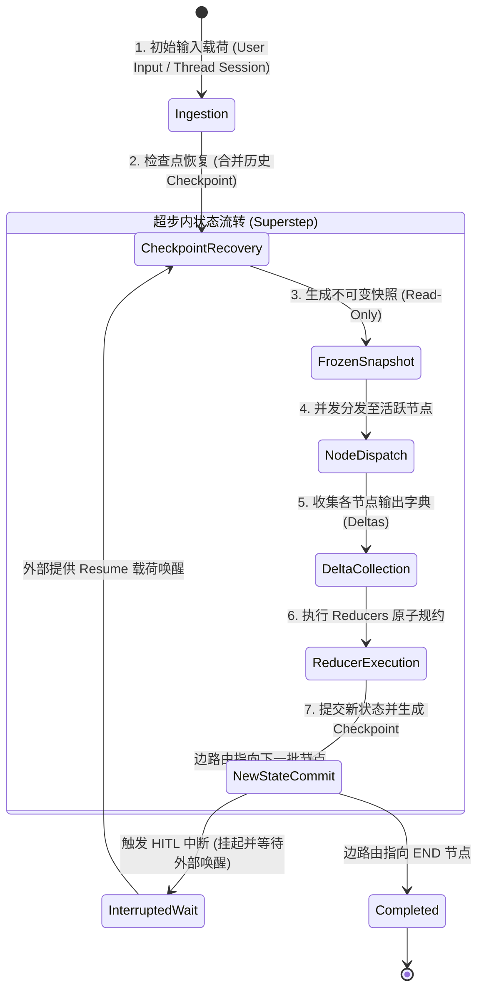

# Jarvis Agent Pro 状态设计规范 (State Design)

## 1. 核心理念：State 是图的一等公民

在 LangGraph 架构中，**状态（State）** 是整个图的单一可信数据源（Single Source of Truth），也是节点之间唯一的通信媒介。

- **节点（Nodes）不持有内部业务状态**：节点退化为纯函数或只读消费者，通过输入当前状态切片，输出部分增量更新（Partial State Update）。
- **更新不依赖命令式赋值**：图的更新依赖声明式的**规约器（Reducers）**。状态的更新过程是确定性、原子化且并发安全的。

---

## 2. State 生命周期 (State Lifecycle)

State 的生命周期贯穿于图的初始化、超步流转、中断挂起与最终交付：



### 2.1 生命周期各阶段详解

1. **输入与初始化 (Ingestion)**:
   - 外部调用 `graph.invoke(input_data, config)`。
   - 输入数据根据 Schema 校验，缺失字段应用预设默认值。
2. **检查点恢复 (Checkpoint Recovery)**:
   - 根据 `thread_id` 从 Checkpointer 加载最新检查点，与输入数据进行规约合并，恢复到上一次停止的准确状态。
3. **只读快照生成 (Frozen Snapshot)**:
   - 在每个超步开始前，系统创建当前状态的不可变只读视图。同一超步内并发运行的所有节点均读取完全相同的一致性快照。
4. **增量收集 (Delta Collection)**:
   - 节点执行完毕后，返回局部更新字典（例如 `{"messages": [AIMessage(...)]}`）。
   - 节点严禁直接修改入参 state 对象。
5. **规约器执行 (Reducer Execution)**:
   - 调度器遍历节点返回的字典，找到对应的字段 Reducer 函数。
   - 规约器执行原子合并，生成下一个版本的状态对象。
6. **检查点提交 (Checkpoint Commit)**:
   - 新状态生成后，连同元数据（生成该状态的节点名、超步计数、时间戳）写入持久化存储。
7. **图终止或中断 (Termination / Interrupt)**:
   - 若命中中断，执行冻结并向调用端返回状态；若路由至 `END`，输出最终状态给应用层。

---

## 3. State 字段规范定义 (Schema)

Jarvis Agent Pro 的状态基于强类型 `typing_extensions.TypedDict` 定义。

### 3.1 字段概览与定义

```python
from typing import Annotated, Sequence, Optional, Any, Dict, List, Literal
from typing_extensions import TypedDict
from langchain_core.messages import BaseMessage
from langgraph.graph.message import add_messages


def append_reducer(existing: Optional[List[Any]], update: Optional[Union[Any, List[Any]]]) -> List[Any]:
    """自定义追加规约器：支持元素单体或列表追加"""
    existing_list = list(existing) if existing else []
    if update is None:
        return existing_list
    if isinstance(update, list):
        return existing_list + update
    return existing_list + [update]


def overwrite_reducer(existing: Any, update: Any) -> Any:
    """显式覆盖规约器：无条件采用最新值"""
    return update


class AgentState(TypedDict):
    """
    Jarvis Agent Pro 核心图状态模型
    """
    
    # 1. 对话与操作历史 (消息流)
    # 使用 LangGraph 官方成熟的 add_messages 规约
    # 支持根据 ID 增量追加、基于相同 ID 就地覆盖更新、或根据 RemoveMessage 删除
    messages: Annotated[Sequence[BaseMessage], add_messages]

    # 2. 任务总目标 (一次会话生命周期内保持稳定)
    task_goal: str

    # 3. 规划与拆解状态 (当前活动计划与子步骤)
    # 由 Planner 节点更新，无 Reducer 时默认覆盖最新完整计划
    plan: Optional[Dict[str, Any]]

    # 4. 待执行或正在审批的动作载荷
    pending_action: Optional[Dict[str, Any]]

    # 5. 人机协同审批标志
    # 用于记录人机交互审查状态：None -> 'pending' -> 'approved' / 'rejected'
    approval_status: Optional[Literal["pending", "approved", "rejected"]]

    # 6. 工作暂存草稿本 (Scratchpad / Observations)
    # 采用 append_reducer，允许各节点追加中间观察与思维痕迹
    scratchpad: Annotated[List[str], append_reducer]

    # 7. 并发分支聚合区 (Parallel Branch Results)
    # 存储多个并行子节点完成后的结果字典
    branch_results: Annotated[Dict[str, Any], lambda a, b: {**(a or {}), **(b or {})}]

    # 8. 运行时元数据控制 (递归深度、会话环境配置)
    metadata: Dict[str, Any]
```

---

## 4. State 更新规则 (Update Rules)

在 LangGraph 中，状态更新的规则由字段类型注解中的 `Annotated[T, ReducerFunction]` 决定。

### 4.1 规约器类型分类

| 规约器模式 | 语法形式 | 行为表现 | 典型应用字段 |
|---|---|---|---|
| **默认覆盖模式 (Default Overwrite)** | `field: Type` | 当节点返回该字段时，直接替换原有值。 | `task_goal`, `plan`, `approval_status` |
| **消息智能追加 (add_messages)** | `Annotated[Sequence[BaseMessage], add_messages]` | 根据消息 ID 进行幂等合并、更新或追加。 | `messages` |
| **列表追加规约 (Append List)** | `Annotated[List[T], append_reducer]` | 将节点返回的单个元素或列表追加到原列表尾部。 | `scratchpad`, `execution_log` |
| **字典键值合并 (Dict Merge)** | `Annotated[Dict[str, Any], merge_dict]` | 类似字典 `update`，保留已有键并合并/覆写新键。 | `branch_results`, `env_vars` |

---

## 5. State 合并策略与并发写安全 (State Merge & Concurrency)

在多分支并发执行（如 Phase10 的 Fan-out 分支）时，多个节点会同时向 State 提交更新。框架如何解决冲突？

### 5.1 冲突解决矩阵

```
                节点 A 输出: {"scratchpad": ["A 完成"], "branch_results": {"branch_a": 1}}
                                         │
                                         ▼
节点 B 输出: {"scratchpad": ["B 完成"], "branch_results": {"branch_b": 2}}
                                         │
                                         ▼
                               [框架 Superstep 汇聚]
                                         │
                                         ▼
                       执行 Reducers 排序并应用规约:
       - scratchpad: append_reducer -> ["A 完成", "B 完成"]
       - branch_results: dict_reducer -> {"branch_a": 1, "branch_b": 2}
```

### 5.2 确定性合并准则 (Deterministic Merge Guidelines)

1. **写写隔离原则 (Write-Write Isolation)**:
   - 不同的并发节点应当写入不同的字典键，或写入配置了无序可交换（Commutative）Reducer 的字段（如 Set Union 或 List Append）。
2. **禁止对覆盖型字段进行无序并发写入**:
   - 若 `plan` 字段未配置 Reducer（即覆盖模式），严禁两个并发节点在同一超步中同时更新 `plan`。若发生此类更新，LangGraph 默认会按节点完成的先后顺序产生竞态风险，或抛出并发冲突警告。
3. **消息去重机制 (Idempotent Message Upsert)**:
   - `add_messages` 内部会自动检查 `message.id`。
   - 若收到相同 ID 的消息，则视为原地编辑（如流式输出补全工具调用 ID），避免重复追加造成上下文膨胀。

---

## 6. 上下文压缩与状态修剪策略 (State Compaction)

随着 Agent 长时间运行，`messages` 列表可能超出大模型上下文窗口（Context Window）。

在 Graph 状态设计中，修剪策略通过专用的 **State Pruning Node** 或 **Reducer 级修剪** 实现：

1. **RemoveMessage 原语**:
   - 向 `messages` 写入 `RemoveMessage(id=msg_id)`，`add_messages` 规约器会自动将该消息从状态历史中物理移除。
2. **摘要压缩节点 (Summarization Node)**:
   - 当 `len(messages) > THRESHOLD` 时，条件路由引导至 `summarize_node`。
   - 该节点调用轻量模型将早期消息折叠为一条 `SystemMessage(content="历史摘要...")`，并使用 `RemoveMessage` 批量清理旧消息。
   - 保持图状态精炼且不破坏 Checkpoint 的历史可溯性。
